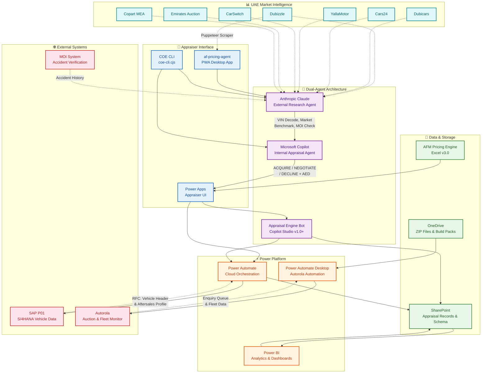

# Architecture & Design

This page presents the system architecture of the COE's pricing and appraisal ecosystem, illustrating how all components connect and interact to deliver end-to-end vehicle valuation capabilities.

---

## System Architecture Overview

The following diagram shows the high-level architecture of the COE pricing ecosystem, including all major platforms, data flows, and integration points.

---

## Architecture Layers

The system is organized into six distinct layers, each with a clear responsibility.

### Appraiser Interface Layer

This layer provides the user-facing touchpoints for the pricing team. **Power Apps** serves as the primary enterprise UI for the Vehicle Valuation Workflow. The **af-pricing-agent PWA** provides a lightweight, installable desktop tool for quick pricing lookups. The **COE CLI** enables command-line access to the Dual-Agent Architecture for power users.

### Dual-Agent Layer

The AI layer is built on a complementary two-agent model. **Claude** handles all external research — VIN decoding, UAE market benchmarking across seven platforms, MOI accident interpretation, and GCC/Non-GCC verification. **Microsoft Copilot** manages internal appraisal logic using SAP P01 data and Autorola comments to produce final trade-in decisions. The **Appraisal Engine Bot** in Copilot Studio provides a conversational interface with built-in explainability.

### Power Platform Layer

The orchestration layer leverages Microsoft's Power Platform. **Power Automate (Cloud)** handles workflow orchestration between SharePoint, SAP, and other services. **Power Automate Desktop** manages desktop-level automation for Autorola interactions. **Power BI** provides the analytics and dashboard layer for leadership reporting.

### Data & Storage Layer

**SharePoint** serves as the primary data architecture for appraisal records and governance data. **OneDrive** stores ZIP files, build packs, and deployment artifacts. The **AFM Pricing Engine** (Excel v3.0) provides the calculation backbone for margin and risk analysis.

### External Systems Layer

**SAP P01** (S/4HANA) provides vehicle header and aftersales profile data via RFC calls. **Autorola** supplies auction queue data and fleet intelligence. The **MOI System** provides accident verification data.

### Market Intelligence Layer

Seven UAE market platforms provide the retail and wholesale pricing data that grounds every valuation in current market reality.

---

## Data Flow Summary

The primary data flow follows this sequence:

1. **Vehicle Intake** — VIN entered via Power Apps or COE CLI
2. **External Research** — Claude queries market platforms, MOI, and performs VIN decoding
3. **Internal Analysis** — Copilot processes SAP data and Autorola comments
4. **Valuation** — Both agents produce independent pricing; results are cross-validated
5. **Decision** — Final ACQUIRE / NEGOTIATE / DECLINE recommendation with AED pricing
6. **Storage** — All data, decisions, and audit trails written to SharePoint
7. **Reporting** — Power BI dashboards surface analytics for leadership

---

## Design Principles

| Principle | Implementation |
|---|---|
| **Modularity** | Each component can be updated, tested, or rolled back independently |
| **Audit Readiness** | Every decision is logged with full reasoning chain |
| **Governance-First** | All data flows respect M365 and corporate compliance boundaries |
| **Manual Fallback** | Every automated path has a documented manual alternative |
| **Zero Hallucination** | AI agents are constrained to produce only data-grounded outputs |
| **Versioned Deployment** | Build packs are versioned (v1.0–v1.7+) for precise change tracking |
